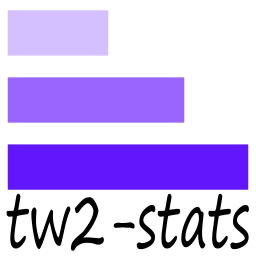

```tw2-stats``` is a tool that provides statistics for the online browser game "Tribal Wars 2". You can find a working version of the tool at: [tw2-stats.com](https://tw2-stats.com/). For information about how to set it up locally visit our [wiki page](https://github.com/VMormoris/tw2-stats/wiki).

## Contributing
* _For reporting a bug please open an issue describing the bug._
* _If you want to contribute or suggest a new feature open an issue describing what you want._
* _Feel free to work to any of the open issues and make a pull request._

## Third Party Tools
* [PostgreSQL](https://www.postgresql.org/)
* [Apache2](https://httpd.apache.org/)
* [Laravel](https://laravel.com/)
* [laravel-cte](https://github.com/staudenmeir/laravel-cte)
* [Vue3](https://vuejs.org/)
* [Bootstrap](https://getbootstrap.com/)
* [vue-chart-3](https://vue-chart-3.netlify.app/)
* [ChartJS](https://www.chartjs.org/)
* [ForkAwesome](https://forkaweso.me/Fork-Awesome/)

If you want to **keep up with changes** or if you have **questions** that don't require opening issue come and join our [discord server](https://discord.com/invite/vxZbCrShaP).